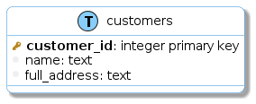
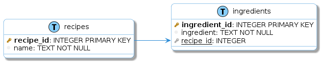

Examples
=============

The best way to understand how this works, and what is useful for, it's probably with some examples, so here we go:

.. contents:: Table of Contents

CSV input format
----------------

The CSV should be just a simple file, with no headers, where each line represents an attribute of a table.

For example, take the following data:

Example 1: Just 1 table
-----------------------

.. list-table:: Table (recipes)
   :widths: 30 30 40
   :header-rows: 1

   * - recipe_id
     - name
     - ingredients
   * - 1
     - Chimichurri
     - | 1/2 Cup Oil
       | 2 tablespoons red wine vinegar
       | 1/2 cup finely chopped parsley
       | 1 tablespoon finely chopped chili
       1 teaspoon salt
       (...)

The CSV that represents this table (`example1.csv <https://github.com/matteemol/dbSketcher/tree/rtd-docs/examples/example1.csv>`_) would state

.. code-block:: python
    
    recipes, recipe_id, integer primary key
    recipes, name, text not null
    recipes, ingredients, text

As you can see, lines can be decomposed in three parameters each:

| ``[TABLE NAME]`` = recipes
| ``[ATTRIBUTE NAME]`` = recipe_id
| ``[BASIC SQLITE DEFINITION]`` = integer primary key

| ``[TABLE NAME]`` = recipes
| ``[ATTRIBUTE NAME]`` = name
| ``[BASIC SQLITE DEFINITION]`` = text not null

| ``[TABLE NAME]`` = recipes
| ``[ATTRIBUTE NAME]`` = ingredients
| ``[BASIC SQLITE DEFINITION]`` = text

.. warning::
    Currently, the way to indicate that the attribute is a key, is:

    Primary Key: ``primary key``, ``primary_key``, ``pk``, ``pkey``

    Foreign Key: ``foreign key``, ``foreign_key``, ``fk``, ``fkey``

    Any other term used may rise to incorrect outputs (missing relationships)

Then, after running in the terminal:

.. code-block:: python

  python dbsketcher/run.py examples/example1.csv

We'll get two new output files:

* `example1.sql <https://github.com/matteemol/dbSketcher/tree/rtd-docs/examples/example1.sql>`_

.. code-block:: python

  CREATE TABLE IF NOT EXISTS recipes (
  recipe_id INTEGER PRIMARY KEY,
  name TEXT NOT NULL,
  ingredients TEXT
  );

* `example1.uml <https://github.com/matteemol/dbSketcher/tree/rtd-docs/examples/example1.uml>`_

.. code-block:: python

  @startuml

  left to right direction
  skinparam roundcorner 15
  skinparam shadowing true
  skinparam handwritten false
  skinparam class {
      BackgroundColor white
      ArrowColor #2688d4
      BorderColor #2688d4
  }

  !define table(x) entity x << (T, LightSkyBlue) >>
  !define primary_key(x) <b><color:#b8861b><&key></color> x</b>
  !define foreign_key(x) <color:#aaaaaa><&key></color> <u>x</u>
  !define column(x) <color:#efefef><&media-record></color> x
  !define column_fk(x) <color:#efefef><&media-record></color> <u>x</u>

  table( recipes ) {
    primary_key( recipe_id ): INTEGER PRIMARY KEY
    column( name ): TEXT NOT NULL
    column( ingredients ): TEXT
  }

  @enduml

That renders to:

Example 2: Just 1 table with multiple items
-------------------------------------------

| Okay, that table it's kind of awful. Really, really unnormalized.
| A **sligthly** better version could be:

.. list-table:: Table (recipes)
   :widths: 30 30 40
   :header-rows: 1

   * - recipe_id
     - name
     - ingredient
   * - 1
     - Chimichurri
     - 1/2 Cup Oil
   * - 1
     - Chimichurri
     - 2 tablespoons red wine vinegar
   * - 1
     - Chimichurri
     - 1/2 cup finely chopped parsley
   * - 1
     - Chimichurri
     - 1 tablespoon finely chopped chili
   * - 1
     - Chimichurri
     - 1 teaspoon salt
   * - 1
     - Chimichurri
     - (...)

Since the information that the CSV file contains are the columns (attributes) names, the table to where they belong and the sql syntax that generates them, the **ONLY** difference in this file would be the name of the third column: as we now denormalized the table a little bit, we now have a column for each ingredient, so we changed ``ingredients`` by ``ingredient`` (without the last "s")

.. code-block:: python
    
    recipes, recipe_id, integer primary key
    recipes, name, text not null
    recipes, ingredient, text

So the other files would change in a similar way.

Example 3: 2 tables
-------------------

| If we go a little bit further in normalization, the first thing we should do, would be to split the recipe's name from the ingredients, right?

.. list-table:: Table 1 (recipes)
   :widths: 25 75
   :header-rows: 1

   * - recipe_id (primary_key)
     - name
   * - 1
     - Chimichurri

.. list-table:: Table 2 (ingredients)
   :widths: 25 55 20
   :header-rows: 1

   * - ingredient_id (primary_key)
     - ingredient
     - recipe_id (foreign_key)
   * - 1
     - 1/2 Cup Oil
     - 1
   * - 2
     - 2 tablespoons red wine vinegar
     - 1
   * - 3
     - 1/2 cup finely chopped parsley
     - 1
   * - 4
     - 1 tablespoon finely chopped chili
     - 1
   * - 5
     - 1 teaspoon salt
     - 1
   * - 6
     - (...)
     - (...)

Now the ``recipe_id`` attribute is not only the ``primary_key`` of the first table (**recipes**), but it's also the ``foreign_key`` of the second table (**ingredients**)

The CSV (`example3.csv <https://github.com/matteemol/dbSketcher/tree/rtd-docs/examples/example3.csv>`_) now does have some 'major' changes:

.. code-block:: python
    
    recipes, recipe_id, integer primary key
    recipes, name, text not null
    ingredients, ingredient_id, integer primary key
    ingredients, ingredient, text not null
    ingredients, recipe_id, integer foreign key (recipes)

And the ERD diagram (`example3.uml <https://github.com/matteemol/dbSketcher/tree/rtd-docs/examples/example3.uml>`_) is transformed to:

Example 4: Several tables
-------------------------

| The following diagram -which has several tables and keys-:

.. list-table:: Table 1 (recipes)
   :widths: 25 50 25
   :header-rows: 1

   * - recipe_id (primary_key)
     - name
     - type_id (foreign_key)
   * - 1
     - Chimichurri
     - 2
   * - 2
     - Criolla
     - 2
   * - 3
     - Flan
     - 5

.. list-table:: Table 2 (recipe_type)
   :widths: 25 75
   :header-rows: 1

   * - type_id (primary_key)
     - type_name
   * - 1
     - Starter
   * - 2
     - Dressing
   * - 3
     - Main course
   * - 4
     - Side dish
   * - 5
     - Dessert

.. list-table:: Table 3 (recipe_ingredients)
   :widths: 20 20 20 20 20
   :header-rows: 1

   * - recipe_id (foreign_key)
     - ingredient_id (foreign_key)
     - quantity
     - unit_of_measurement
     - preparation
   * - 1
     - 1
     - 1/2
     - Cup
     - 
   * - 1
     - 2
     - 2
     - tablespoons
     - 
   * - 1
     - 3
     - 1/2
     - Cup
     - Finely chopped

.. list-table:: Table 4 (ingredient_list)
   :widths: 20 80
   :header-rows: 1

   * - ingredient_id (primary_key)
     - ingredient_name
   * - 1
     - Sunflower Oil
   * - 2
     - Red wine vinegar
   * - 3
     - Parsley
   * - 4
     - Chili
   * - 5
     - Salt

